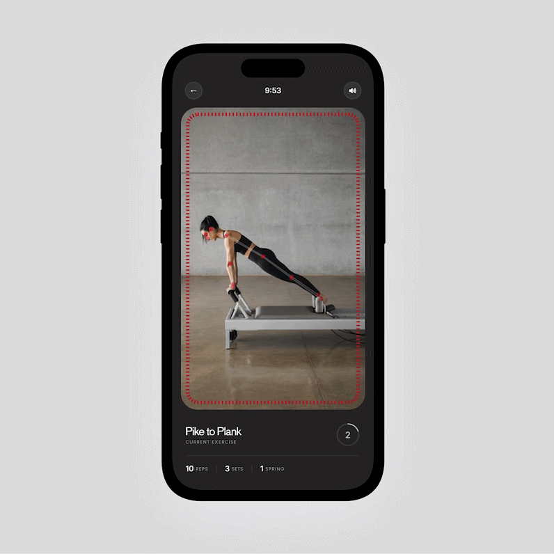

# reflo

[Try the live demo →](https://reflo-pilates.vercel.app/)

[Read the full case study →](https://riyashenoy.com/projects/reflo)

Motion-capture pilates coaching in your browser. reflo watches your form through your phone's camera and coaches you with a real voice, in real time.

Best experienced on a mobile browser: open the demo in Safari or Chrome on your phone and allow camera access. The live workout screen has a skip button to jump to the end for demo purposes.

## What it does

reflo turns your phone camera into a form coach. It tracks your body as you move through a pilates class, detects when your form breaks, and speaks a correction in the moment, timed into the gaps in the instructor's audio so it never talks over the class.

Beyond the flagship class, reflo composes personalized workouts. You give it your goals and training frequency, and it builds a weekly plan from a tagged exercise library, then generates the voice coaching on demand.

It's built as homework between studio sessions, not a replacement for them. It's a way to practice with feedback so you arrive at real classes with cleaner fundamentals.

## Features

- Real-time pose tracking with an on-device pose model (17 body landmarks)
- Color-coded skeleton overlay: red while tracking, teal on a correction, grey when out of frame
- Voice corrections timed into silent gaps in the instructor audio
- Out-of-frame detection with automatic recovery
- AI-composed weekly plans generated from user goals and a tagged exercise library
- On-demand voice generation for generated workouts, paced from rep counts
- Real session history driving streak, progress, and calendar
- Firebase auth, 3-step profile onboarding, post-workout report
- Deployed to the web with a mobile-framed viewport

## How it works

The browser's `getUserMedia` API streams the camera feed. MoveNet SinglePose Lightning runs via TensorFlow.js entirely on-device, returning body landmarks every frame. Joint angles are computed with dot-product math against those landmarks, smoothed with a 5-frame rolling average, and checked against per-exercise thresholds.

When a threshold is crossed, a correction is queued but it only plays inside pre-mapped silent windows in the audio track, so feedback never overlaps the instructor. A 4-second per-error cooldown and a lock-on confidence gate keep it from firing on noise or a badly-placed phone.

Personalized routines are composed by an Anthropic model through a serverless function, validated against the real exercise library before anything is written to Firestore, and voiced on demand via OpenAI TTS metered by a weekly quota, since generation is the only real cost.

The flagship class uses a hand-produced ElevenLabs voice track; generated classes route through the same tracking and HUD via a shared voice-mode branch, so the experience stays consistent while cost stays controlled.

## Stack

- React Native (Expo SDK 56) + TypeScript
- React Navigation
- `getUserMedia` for browser camera access
- MoveNet SinglePose Lightning via TensorFlow.js
- Firebase Auth + Firestore
- Serverless functions on Vercel (Anthropic routine generation, OpenAI TTS)
- ElevenLabs (flagship voice), OpenAI TTS (generated voice)

## Status

Active build. The core loop of track, coach, generate and save, works end to end. Remaining work is validation and hardening rather than new systems; see the [open issues](https://github.com/riyashenoy/reflo/issues) for the backlog and the [case study](https://riyashenoy.com/projects/reflo) for the design and product thinking.
